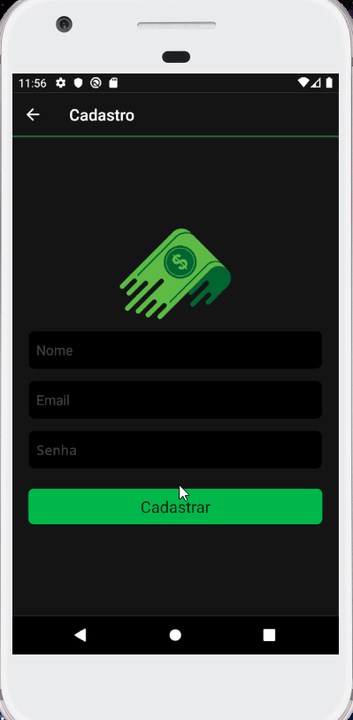

 <h1 align="Left">  
  
  <Strong>Controle Financeiro</Strong>
 </h1>

<h1 align="center">
  
<h1>

# Índice

- [Sobre](#-sobre)
- [Tecnologias Utilizadas](#-tecnologias-utilizadas)
- [Como baixar o projeto](#-como-baixar-o-projeto)

---

# 💲 Sobre

Simples aplicação de controle de receitas e despesas, com filtros e toda segurança e autenticação via firebase.

---

## 💻 Tecnologias utilizadas

O projeto foi desenvolvido utilizando as seguintes tecnologias?

- React Native;
- Styled Components;
- Firebase;
- Date Fns;

---

## 📁 Como baixar o projeto

```bash
# Clonar o repositório
  $ git clone https://github.com/LuizTimboAlcantara/financeiro_react_native

# Entrar na pasta do projeto
  $ cd financeiro_react_native

# Instalar as dependências do projeto
  $ npm install

# Configurações
  $ É necessário ter o Android Studio ou XCode corretamente configurado assim como um simulador ou 
    dispositivo configurado para simular a aplicação.

# Rodar a aplicação
  $ Android: npx react-native run-android

  $ IOS: npx react-native run-ios

# Para efetuar login
  $ Você deve criar um usuário e senha que serão salvos no firebase.
```
